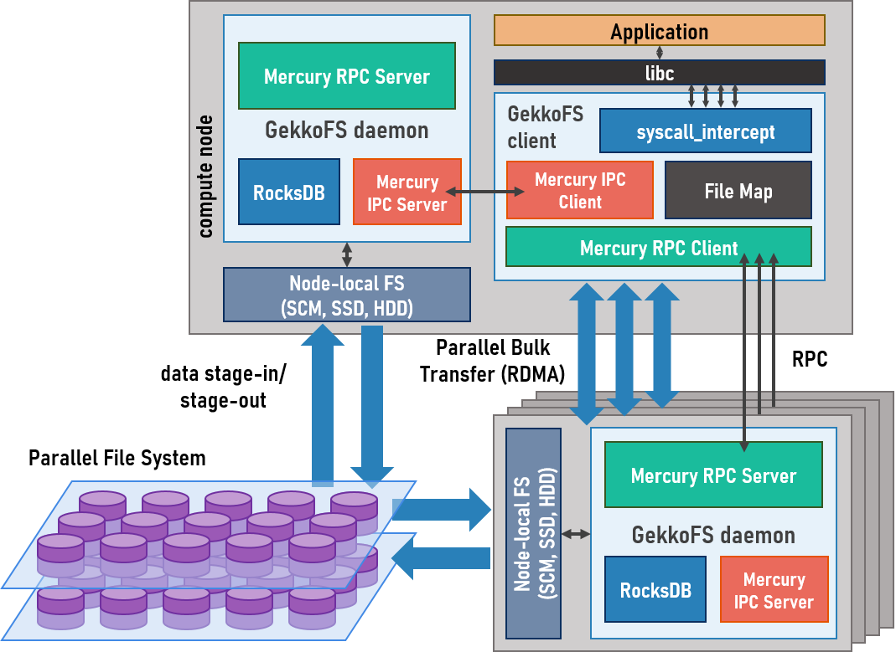

.. GekkoFS documentation master file, created by
   sphinx-quickstart on Sun Mar  3 23:49:53 2019.
   You can adapt this file completely to your liking, but it should at least
   contain the root `toctree` directive.

======================================================
GekkoFS: A burst-buffer file system for HPC
======================================================

GekkoFS is a highly scalable user-level distributed file system for HPC
clusters.  GekkoFS is capable of aggregating the local
I/O capacity and performance of compute nodes to produce a high-performance
storage space for applications. With GekkoFS, HPC applications and simulations
can run in isolation from each other with regards to I/O, which reduces
interferences and improves performance. Furthermore, GekkoFS has been designed
with configurability in mind, and allows users to fine tune several of the
default POSIX file system semantics (e.g. support for symbolic links or strict
bookkeeping of file access timestamps) that, even if useful, might not be
required by their applications and hence negatively impact their I/O
performance.

Contrary to general purpose file systems, a GekkoFS file system is ephemeral in
nature. That is, the lifetime of a GekkoFS file system instance is linked to
the duration of the execution of its GekkoFS server processes, which are
typically spawned when an HPC job starts and shut down when it ends. This
means that users must copy any files that need to be persisted beyond the
lifetime of the job from GekkoFS to a more permanent file system such as Lustre or
GPFS.  Also, because GekkoFS is implemented at user-level, the file system is
only visible to applications using one of the GekkoFS client libraries.
A consequence of this is that traditional file system tools (ls, cd, etc.)
installed by system administrators will not be aware of files in a GekkoFS file
system. To solve this, GekkoFS provides a client interception library that can
be preloaded before calling these tools.

---------------------------
Architecture
---------------------------

.. toctree::
   :maxdepth: 2
   :caption: User guide

   users/building
   users/running
   users/forwarding
   users/scripts

.. toctree::
   :maxdepth: 2
   :caption: Contributing

.. toctree::
   :maxdepth: 2
   :caption: Developer documentation

   devs/testing
   api/reference

Indices and tables
==================

* :ref:`genindex`
* :ref:`modindex`
* :ref:`search`
